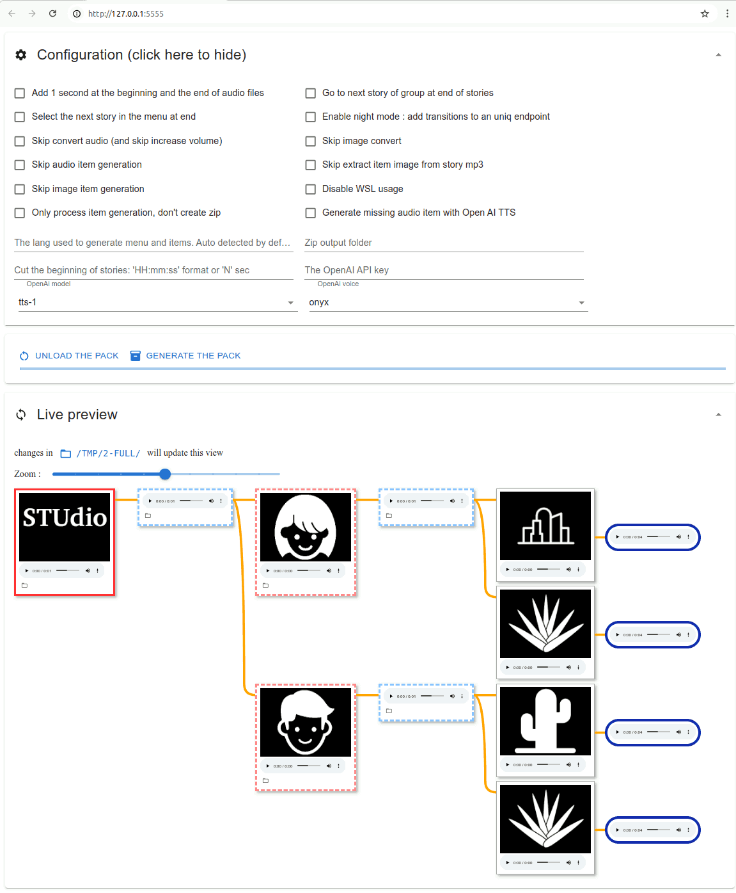

# Studio-Pack-Generator (SPG)

This project convert a folder or a RSS URL to
[Studio](https://github.com/marian-m12l/studio) pack zip for Lunii device, see
file structure below.

Supported OS: Windows / Linux / macOS

**[⭐ Une grosse communauté est présente sur Discord pour créer et partager des pack Lunii ! ⭐](https://discord.com/invite/jg9MjHBWQC)**

**[⭐ A big french community is present on Discord to create and share Lunii packs ⭐](https://discord.com/invite/jg9MjHBWQC)**

**🔊💬🎵 Other devices/Apps use the Studio pack format :**

- [Telmi-story-teller](https://github.com/DantSu/Telmi-story-teller) for the
  Miyoo Mini retro gaming console
- [Conty](https://github.com/Akylas/conty) -
  [android app on the PlayStore](https://play.google.com/store/apps/details?id=com.akylas.conty)
- [Boîte à histoires - android app apk](https://github.com/Cyri1/bah)
- [Nimilou](https://github.com/octera/Nimilou) -
  [android app on the PlayStore](https://play.google.com/store/apps/details?id=info.octera.droidstorybox)
- [Grigri - the open storyteller](https://github.com/olup/grigri)
- [open-story-teller - Open source hardware/software](https://github.com/arabine/open-story-teller)

## Quick start

```shell
studio-pack-generator "my story folder OR a RSS URL"
```

will generate "my story folder-xxxxxxxxxx.zip" that can be imported in
[Studio](https://github.com/marian-m12l/studio)

Examples:

- `studio-pack-generator http://radiofrance-podcast.net/podcast09/rss_19721.xml`
- `studio-pack-generator "Musics"`
- `studio-pack-generator "Encore une histoire"`

## Optional dependencies

**[Windows release](https://github.com/jersou/studio-pack-generator/releases) of
studio-pack-generator embeds these tools in zip file, and use Windows TTS
instead of picoTTS (unless you have WSL and picoTTS installed).**

- **ffmpeg** : used to extract images from story mp3 files, increase volume of
  files, convert to the right format.
  <br>→ Use `--skip-audio-convert` and `--skip-extract-image-from-mp3` to avoid
  this usage.
- **imagemagick** : used to generate menu image files.
  <br>→ Use `--skip-image-item-gen` to avoid this usage.
- **picoTTS** : used to generate menu audio files.
  <br>→ Use `--skip-audio-item-gen` to avoid this usage.

Install optional dependencies :
`sudo apt update && sudo apt install -y ffmpeg libttspico-utils imagemagick`

Use "-miva" option to skip all generations that use these tools.

## Install studio-pack-generator

### Install binary from [release page](https://github.com/jersou/studio-pack-generator/releases) and run it :

```
studio-pack-generator-x86_64-linux            "my story folder or a rss url"
or  studio-pack-generator-x86_64-windows.exe  "my story folder or a rss url"
or  studio-pack-generator-aarch64-apple       "my story folder or a rss url"
or  studio-pack-generator-x86_64-apple        "my story folder or a rss url"
```

#### Or clone the repo and run with [Deno](https://deno.land/) :

This project is written in Typescript for [deno](https://deno.land/) runtime.
Install deno : https://deno.land/

```
git clone https://github.com/jersou/studio-pack-generator
cd studio-pack-generator
deno -A studio_pack_generator.ts "my story folder or a rss url"
```

#### Or run from web directly (will be cached for the next launches) :

```
deno -A jsr:@jersou/studio-pack-generator "my story folder or a rss url"
```

## Story folder structure

Simplest example, only 1 menu level, without audio/image of menus/items :

```shell
📂 Story folder
└── 📂 Choose a story         ← 📂 first menu
    ├── 🎵 the story 1.mp3      ← 📗 audio story
    ├── 🎵 the story 2.mp3      ← 📗 audio story
    └── 🎵 the story 3.mp3      ← 📗 audio story
```

Simple example, 2 levels of menus, without audio/image of menus/items :

```shell
📂 Story folder
└── 📂 Choose a character          ← 📂 first menu
    ├── 📂 Alice                     ← 📂 first choice of the first menu
    │   └── 📂 Choose a place          ← 📂 second menu
    │       ├── 🎵 the city.mp3          ← 📗 audio story
    │       └── 🎵 the jungle.mp3        ← 📗 audio story
    └── 📂 Bob                       ← 📂 second choice of the first menu
        └── 📂 Choose a place          ← 📂 second menu
            ├── 🎵 the desert.mp3        ← 📗 audio story
            └── 🎵 the jungle.mp3        ← 📗 audio story
```

studio-pack-generator will generate menu files, they could be manually
overwritten, and the next studio-pack-generator run will not regenerate these
files :

```shell
📂 Story folder
├── 🎵 0-item.mp3                     ← ⏩ story audio title, generated if missing
├── 🔳 0-item.png                     ← ⏩ story image title, generated if missing
├── 🔳 0-night-mode.mp3               ← ⏩ story audio night mode transition, generated if missing and if the mode is enable
└── 📂 Choose a character             ← 📂 first menu
    ├── 🎵 0-item.mp3                   ← ⏩ audio menu, generated if missing
    ├── 📂 Alice                        ← 📂 first choice of the first menu
    │   ├── 🎵 0-item.mp3                 ← ⏩ audio choice, generated if missing
    │   ├── 🔳 0-item.png                 ← ⏩ image choice, generated if missing
    │   └── 📂 Choose a place             ← 📂 second menu
    │       ├── 🎵 0-item.mp3               ← ⏩ audio menu, generated if missing
    │       ├── 🔳 0-item.png               ← ⏩ audio menu, generated if missing
    │       ├── 🎵 the city.item.mp3        ← ⏩ audio story title, generated if missing
    │       ├── 🔳 the city.item.png        ← ⏩ image story title, generated if missing
    │       ├── 🎵 the city.mp3             ← 📗 audio story
    │       ├── 🎵 the jungle.item.mp3      ← ⏩ audio story title, generated if missing
    │       ├── 🔳 the jungle.item.png      ← ⏩ image story title, generated if missing
    │       └── 🎵 the jungle.mp3           ← 📗 audio story
    └── 📂 Bob                          ← 📂 second choice of the first menu
        ├── 🎵 0-item.mp3                 ← ⏩ audio choice, generated if missing
        ├── 🔳 0-item.png                 ← ⏩ image choice, generated if missing
        └── 📂 Choose a place                ← 📂 second menu
            ├── 🔳 0-item.mp3               ← ⏩ audio menu, generated if missing
            ├── 🔳 0-item.png               ← ⏩ audio menu, generated if missing
            ├── 🎵 the desert.item.mp3      ← ⏩ audio story title, generated if missing
            ├── 🔳 the desert.item.png      ← ⏩ image story title, generated if missing
            ├── 🎵 the desert.mp3           ← 📗 audio story
            ├── 🎵 the jungle.item.mp3      ← ⏩ audio story title, generated if missing
            ├── 🔳 the jungle.item.png      ← ⏩ image story title, generated if missing
            └── 🎵 the jungle.mp3           ← 📗 audio story
```

There is no limit to the nesting of menus, for example :

```shell
📂 Story folder
└── 📂 Choose a character                 ← 📂 first menu
    ├── 📂 Alice                            ← 📂 first choice of the first menu
    │   └── 📂 Choose a place                ← 📂 second menu
    │       └── 📂 Building                    ← 📂 second choice of the first menu
    │       │   └── 📂 Choose the floor          ← 📂 third menu
    │       │       ├── 🎵 the floor 1.mp3         ← 📗 audio story
    │       │       └── 🎵 the floor 2.mp3         ← 📗 audio story
    │       ├── 🎵 the city.mp3                ← 📗 audio story : mix menus/stories is possible
    │       └── 🎵 the jungle.mp3              ← 📗 audio story : mix menus/stories is possible
    ├── 🎵 Bob.mp3                         ← 📗 audio story : mix menus/stories is possible
    ...
```

### Zip Pack aggregation

_Since v0.1.11._

studio-pack-generator can embed zip studio packs in the tree structure :

```shell
📂 Story folder
└── 📂 Choose a character   ← 📂 first menu
    ├── 📦 Alice.zip           ← 📦 pack as menu entry
    ├── 🎵 Bob.mp3             ← 📗 audio story
    ...
```

The "super pack" will look like :

```shell
📂 Story folder
└── 📂 Choose a character                 ← 📂 first menu
    ├── 📂 Alice                            ← 📂 The Alice.zip pack
    │   └── 📂 Choose a place                ← 📂 second menu
    │       └── 📂 Building                    ← 📂 second choice of the first menu
    │       │   └── 📂 Choose the floor          ← 📂 third menu
    │       │       ├── 🎵 the floor 1.mp3         ← 📗 audio story
    │       │       └── 🎵 the floor 2.mp3         ← 📗 audio story
    │       ├── 🎵 the city.mp3                ← 📗 audio story
    │       └── 🎵 the jungle.mp3              ← 📗 audio story
    ├── 🎵 Bob.mp3                         ← 📗 audio story
    ...
```

## Tips

- The first digit of file/folder name are ignored, it's useful to sort
  stories/menus.
- To keep numbers in generated items : "- 3 petits cochons.mp3" or "12 - 3
  petits cochons.mp3".
- Image formats : png, jpg, bmp.
- Audio formats : mp3, ogg, opus, wav.

## GUI

To run the GUI, use `--gui` : `studio-pack-generator --gui story-path-here`

The GUI does not work in RSS mode. This mode serve a web app on
http://localhost:5555/



## CLI usage

```
deno run -A studio_pack_generator.ts [options] <story path | RSS URL>    convert a folder or a RSS URL to Studio pack

Options:
  -h, --help                         Show help                                                                 [boolean]
  -d, --add-delay                    add 1 second at the beginning and the end of audio files [boolean] [default: false]
  -n, --auto-next-story-transition   go to next story of group at end of stories              [boolean] [default: false]
  -b, --select-next-story-at-end     select the next story in the menu at end                 [boolean] [default: false]
  -l, --lang                         the lang used to generate menu and items. Auto detected by default         [string]
  -t, --night-mode                   enable night mode : add transitions to an uniq endpoint  [boolean] [default: false]
  -o, --output-folder                zip output folder                                                          [string]
  -c, --seek-story                   cut the beginning of stories: 'HH:mm:ss' format or 'N' sec                 [string]
  -v, --skip-audio-convert           skip convert audio (and skip increase volume)            [boolean] [default: false]
  -j, --skip-image-convert           skip image convert                                       [boolean] [default: false]
  -a, --skip-audio-item-gen          skip audio item generation                               [boolean] [default: false]
  -m, --skip-extract-image-from-mp3  skip extract item image from story mp3                   [boolean] [default: false]
  -i, --skip-image-item-gen          skip image item generation                               [boolean] [default: false]
      --image-item-gen-font          font used for image item generation                     [string] [default: "Arial"]
      --thumbnail-from-first-item    gen thumbnail from first item instead of first chapter   [boolean] [default: false]
  -s, --skip-not-rss                 skip all except download RSS files                       [boolean] [default: false]
      --rss-split-length             RSS will be split in parts of N length                       [number] [default: 10]
      --rss-split-seasons            RSS create different packs per season                    [boolean] [default: false]
      --rss-episode-numbers          add RSS episode number to stages                         [boolean] [default: false]
      --rss-min-duration             RSS min episode duration                                      [number] [default: 0]
      --rss-use-subtitle-as-title    Use rss items subtitle as title                          [boolean] [default: false]
      --rss-use-image-as-thumbnail   Use rss image (first item with image) as thumbnail       [boolean] [default: false]
      --use-thumbnail-as-root-image  Use thumbnail as 'root' image instead of generated one   [boolean] [default: false]
  -r, --skip-rss-image-dl            skip RSS image download of items                         [boolean] [default: false]
  -w, --skip-wsl                     disable WSL usage                                        [boolean] [default: false]
  -z, --skip-zip-generation          only process item generation, don't create zip           [boolean] [default: false]
  -e, --use-open-ai-tts              generate missing audio item with Open AI TTS             [boolean] [default: false]
  -k, --open-ai-api-key              the OpenAI API key                                                         [string]
  -g, --open-ai-model                OpenAi model : tts-1, tts-1-hd                          [string] [default: "tts-1"]
  -p, --open-ai-voice                OpenAi voice : alloy, echo, fable, onyx, nova, shimmer   [string] [default: "onyx"]
      --use-coqui-tts                use coqui TTS                                            [boolean] [default: false]
      --coqui-tts-model              coqui TTS model [string] [default: "tts_models/multilingual/multi-dataset/xtts_v2"]
      --coqui-tts-language-idx       coqui TTS language_idx                                     [string] [default: "fr"]
      --coqui-tts-speaker-idx        coqui TTS speaker_idx                            [string] [default: "Abrahan Mack"]
  -x, --extract                      extract a zip pack (reverse mode)                        [boolean] [default: false]
  -u, --gui                          open GUI (on localhost:5555)                             [boolean] [default: false]
      --port                         port of GUI server                                         [number] [default: 5555]
      --config-file                  json config file                                                           [string]
      --skip-read-tts-cache          disable the TTS cache usage                              [boolean] [default: false]
      --skip-write-tts-cache         disable the TTS cache write                              [boolean] [default: false]
      --tts-cache-path               path to the TTS cache                [string] [default: "<SPG dir>/.spg-TTS-cache"]
      --custom-script                custom script to be used for custom image... handling                      [string]
```

Separate options by spaces, ex :

- short version : `studio_pack_generator -v -j -a "the story"` or
  `studio_pack_generator -vja "the story"`
- long version :
  `studio_pack_generator --skip-audio-convert --skip-image-convert --skip-audio-item-gen "the story"`

## Features

- Generate studio pack from file tree.
- Generate menu image/audio file if missing.
- Extract image from mp3 file as story image in menu.
- Increase audio volume of stories if needed.
- Download podcast from a RSS url and generate the story tree, cut by parts of
  10 stories.
- Convert mp3 files to right format (mp3, 44100 Hz, mono).
- Convert image files to right format (320x240).
- Generate story thumbnail.
- Option to chaining the stories.
- Option enable the night mode.
- Option to add 1 sec of silence at the beginning and end of sound files.
- Option to skip the beginning of stories.
- Zip Pack aggregation
- OpenAI & Coqui TTS
- a GUI

### Overwrite metadata

If the file `metadata.json` exists in the story folder, it will be used to
overwrite the `story.json` metadata.

All key/value are optional, ex:

```json
{
  "title": "title - overwrite",
  "description": "description - overwrite",
  "format": "v1",
  "version": 1,
  "nightMode": false
}
```

## TTS cache

A folder `<studio-pack-generator install dir>/.spg-TTS-cache/` is used to keep
the generated audio files.

## OpenAI TTS

To use OpenAI TTS, use `--use-open-ai-tts` option, and you must set the API key:

- set OPENAI_API_KEY in the environnement variables
- or use --open-ai-api-key parameter
- or enter the key when the program prompt

## Coqui TTS

Coqui is "a deep learning toolkit for Text-to-Speech":
https://github.com/idiap/coqui-ai-TTS

[To install coqui](https://github.com/idiap/coqui-ai-TTS?tab=readme-ov-file#installation)
: `pip install coqui-tts`

## Reverse process : extract pack from zip

Extract a file stucture from zip pack :

```shell
-x, --extract                      extract a zip pack (reverse mode)                        [boolean] [default: false]
```

Example :

```shell
studio-pack-generator -x 2-full.zip
```

or

```shell
studio-pack-generator -x -o output/dir  2-full.zip
```

Note: it doesn't work well with "menu" nodes and with pack without "question"
stage.

## TTS cache

To speed up / save CPU

## Custom script to fetch RSS image

Usage : `--custom-script=<path>`

```
export interface CustomModule {
   fetchRssItemImage?: (item: RssItem, opt: ModOptions) => Promise<string>;
   fetchRssItemTitle?: (item: RssItem, opt: ModOptions) => Promise<string>;
}
```

## json config file

The parameters can be imported from a json file with :

```
--config-file=<json file path>
```

File format (all the properties are optionals) :

```json
{
  "addDelay": false,
  "autoNextStoryTransition": false,
  "selectNextStoryAtEnd": false,
  "nightMode": false,
  "skipAudioConvert": false,
  "skipImageConvert": false,
  "skipAudioItemGen": false,
  "skipExtractImageFromMp3": false,
  "skipImageItemGen": false,
  "skipNotRss": false,
  "skipRssImageDl": false,
  "skipWsl": false,
  "skipZipGeneration": false,
  "useOpenAiTts": false,
  "lang": "fr-FR",
  "outputFolder": "/tmp/",
  "seekStory": "1",
  "openAiApiKey": "",
  "openAiModel": "tts-1",
  "openAiVoice": "onyx",
  "gui": false,
  "imageItemGenFont": "Arial",
  "thumbnailFromFirstItem": false,
  "rssSplitLength": 10,
  "rssSplitSeasons": false,
  "rssMinDuration": 0,
  "rssUseImageAsThumbnail": false,
  "useThumbnailAsRootImage": false,
  "rssEpisodeNumbers": false,
  "useCoquiTts": false,
  "coquiTtsModel": "tts_models/multilingual/multi-dataset/xtts_v2",
  "coquiTtsLanguageIdx": "fr",
  "coquiTtsSpeakerIdx": "Abrahan Mack",
  "port": 5555,
  "skipWriteTtsCache": false,
  "skipReadTtsCache": false,
  "ttsCachePath": "/tmp/spg-tts-cache",
  "i18n": {
    "special": "Special",
    "season": "Season %d",
    "storyQuestion": "Choose your story",
    "partQuestion": "Choose your part",
    "NightModeTransition": "Want to listen to a new story?"
  }
}
```

At the end of the generation, a file `0-config.json` will be written in the
story folder. It can be use for the next run :
`studio_pack_generator --config-file="<story path>/0-config.json" "<story path>"`

## Development

Some dev command are listed in the deno.json file :

- fmt: format the code
- gen-bin: generate the binaries
- gen-cov: generate the test coverage
- check: deno check studio_pack_generator.ts
- lint: lint the code
- pre-commit: fmt && lint && test && check
- start: run studio_pack_generator.ts
- test: launch tests
- test-watch: launch tests on file change

Usage : `deno task <command>`, ex : `deno task fmt`

Note: some dependencies are vendored in `vendor/` folder, it's to publish on JSR
(which does not allow http imports).

## Possible improvements

- https://github.com/jersou/studio-pack-generator/issues/19 : end node
- clean file download option unless -z
- use https://github.com/rhasspy/piper for TTS
- use git LFS
- ...
